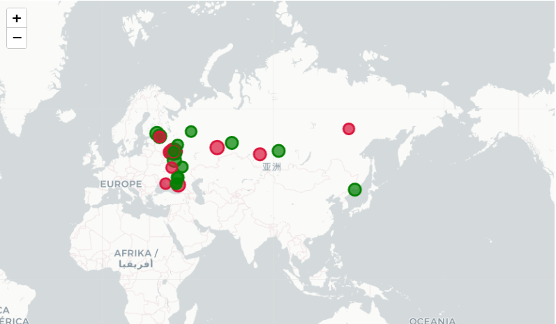
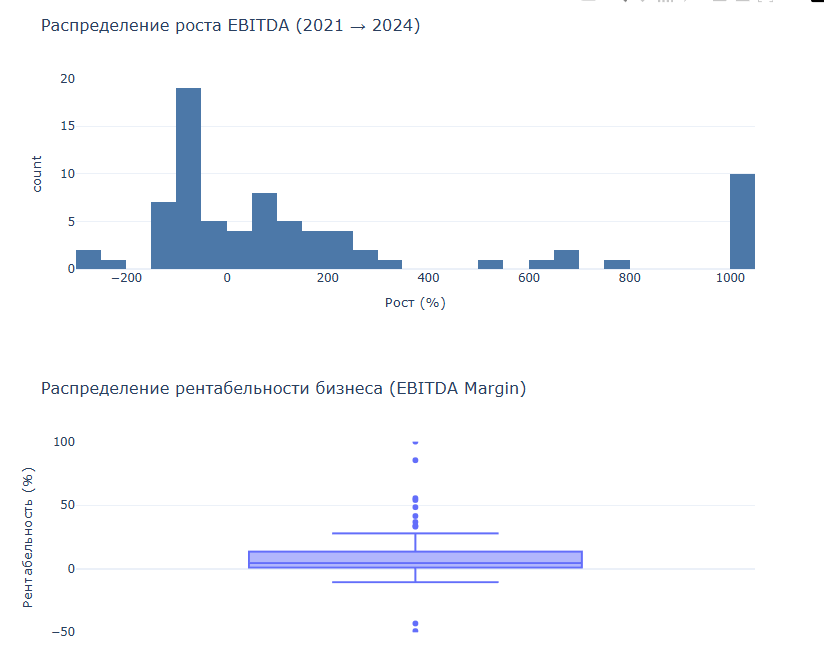

# Анализ финансовой эффективности рынка (ОКВЭД) и автоматизация бизнес-отчетности

Комплексный аналитический проект: от автоматизированного сбора сырых финансовых данных 10 000+ компаний с помощью Python до построения интерактивного бизнес-дашборда, статистического анализа и оценки рентабельности в **Excel**.

---

## 🎯 Цель и бизнес-задача проекта

В рамках исследования рынка (на примере строительной отрасли / заданного ОКВЭД) было необходимо:
1. Собрать актуальную финансовую отчетность компаний за 2021–2024 гг. без ручной рутины.
2. Рассчитать ключевые бизнес-метрики: **Выручка (Revenue)**, **EBITDA**, **Маржинальность бизнеса (EBITDA Margin)**.
3. Провести сегментацию рынка, выделить растущие и падающие компании, оценить распределение рентабельности.
4. Подготовить наглядную интерактивную отчетность в **Excel (Сводные таблицы, Дашборды)** и на географической карте для руководства.

---

## 📊 1. Аналитика и бизнес-отчетность в Excel (Analytics.xlsx)

Ключевой результат проекта представлен в файле **`Analytics.xlsx`**, который содержит глубокую аналитическую проработку собранных данных:

* **Массив данных (Исходные данные):** Обработано **10 000+ строк** финансовой отчетности с расчетом EBITDA и маржинальности по каждой организации.
* **Сводные таблицы и сегментация (Расчеты):** Реализована группировка компаний на «Растущие» и «Падающие» сегменты с помощью динамических сводных таблиц. Рассчитаны итоговые показатели выручки и средней рентабельности по топам рынка.
* **Статистическое моделирование (Analysis ToolPak):** 
  * Проведен парный двухвыборочный t-тест для средних значений (сравнение показателей 2021 и 2024 годов).
  > !(images/t-test.png)
  * Построена многофакторная регрессионная модель (оценка F-статистики, $R^2$, P-значений и доверительных интервалов 95%) для выявления факторов роста бизнеса.
  > !(images/dispers.png)
  * **Интерактивный дашборд:** Наглядная визуализация распределения рентабельности и динамики выручки с использованием срезов (Slicers) для быстрой фильтрации данных.
   > !(images/dashboard.png)

## 🗺️ 2. Визуализация и геоаналитика (Python / Folium / Plotly)

Для наглядного представления гео-распределения бизнеса реализована интерактивная карта (с помощью геокодирования штаб-квартир через DaData API):
* **Размер маркера** на карте пропорционален объему выручки компании.
* **Цвет маркера** отражает эффективность бизнеса относительно медианной рентабельности рынка (зеленый — выше медианы, красный — ниже).

> **Интерактивная карта рентабельности лидеров рынка:**
> 

> **Распределение темпов роста и маржинальности (Plotly):**
> 

---

## 🛠️ 3. Стек технологий и инструменты

* **Бизнес-аналитика и отчетность:** Microsoft Excel (Advanced: Сводные таблицы, Срезы, Пакет анализа / Analysis ToolPak, Дашборды, Регрессионный анализ, t-тест).
* **Язык разработки:** Python 3.12 (Jupyter Notebook).
* **Сбор и обработка данных:** Pandas, NumPy, Requests, ThreadPoolExecutor (многопоточный парсинг для ускорения сбора в 10+ раз).
* **Визуализация:** Plotly, Folium, Matplotlib.
* **API и интеграции:** ГИР БФО ФНС (отчет о финансовых результатах: стр. 2110, 2120, 2410), DaData API (геокодирование).

---

## 🚀 Как воспроизвести сбор данных и запустить код

1. Клонируйте репозиторий и установите зависимости:
   ```bash
   git clone [https://github.com/iiivashiii/analysis.git](https://github.com/iiivashiii/analysis.git)
   cd analysis
   pip install -r requirements.txt

